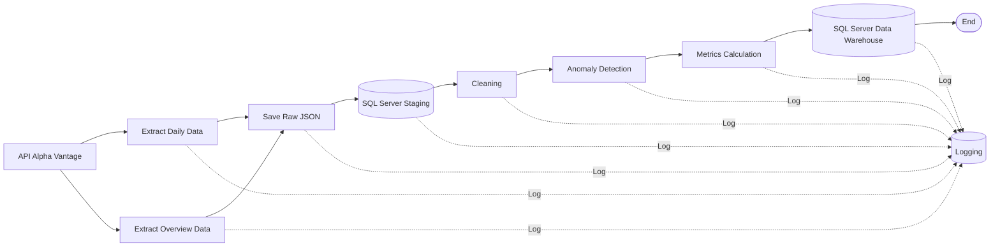

```mermaid
flowchart LR

    A[API Alpha Vantage]
    B1[Extract Daily Data]
    B2[Extract Overview Data]
    C[Save Raw JSON]
    D[(SQL Server Staging)]
    E[Cleaning]
    F[Anomaly Detection]
    G[Metrics Calculation]
    H[(SQL Server Data Warehouse)]
    I([End])

    A --> B1
    A --> B2
    B1 --> C
    B2 --> C
    C --> D
    D --> E
    E --> F
    F --> G
    G --> H
    H --> I

    B1 -. Log .-> L[(Logging)]
    B2 -. Log .-> L
    C -. Log .-> L
    D -. Log .-> L
    E -. Log .-> L
    F -. Log .-> L
    G -. Log .-> L
    H -. Log .-> L
```