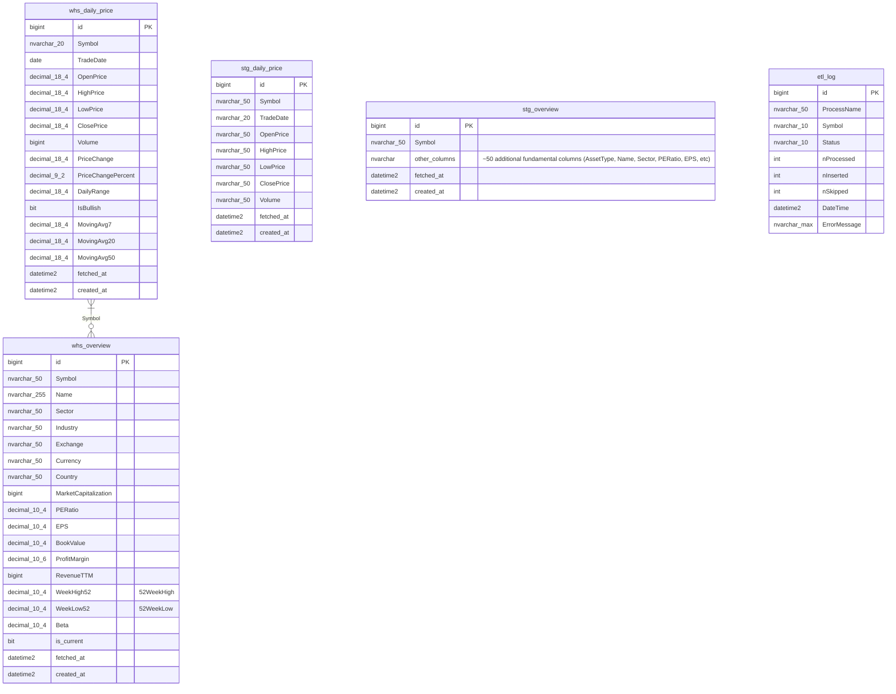

```mermaid
erDiagram

    whs_daily_price }|--o{ whs_overview : "Symbol"
    
    stg_daily_price {
        bigint id PK 
        nvarchar_50 Symbol
        nvarchar_20 TradeDate
        nvarchar_50 OpenPrice
        nvarchar_50 HighPrice
        nvarchar_50 LowPrice
        nvarchar_50 ClosePrice
        nvarchar_50 Volume
        datetime2 fetched_at
        datetime2 created_at
    }

    stg_overview {
        bigint id PK
        nvarchar_50 Symbol
        nvarchar other_columns "~50 additional fundamental columns (AssetType, Name, Sector, PERatio, EPS, etc)"
        datetime2 fetched_at
        datetime2 created_at
    }

    whs_daily_price {
        bigint id PK
        nvarchar_20 Symbol
        date TradeDate
        decimal_18_4 OpenPrice
        decimal_18_4 HighPrice
        decimal_18_4 LowPrice
        decimal_18_4 ClosePrice
        bigint Volume
        decimal_18_4 PriceChange
        decimal_9_2 PriceChangePercent
        decimal_18_4 DailyRange
        bit IsBullish
        decimal_18_4 MovingAvg7
        decimal_18_4 MovingAvg20
        decimal_18_4 MovingAvg50
        datetime2 fetched_at
        datetime2 created_at
    }

    whs_overview {
        bigint id PK
        nvarchar_50 Symbol
        nvarchar_255 Name
        nvarchar_50 Sector
        nvarchar_50 Industry
        nvarchar_50 Exchange
        nvarchar_50 Currency
        nvarchar_50 Country
        bigint MarketCapitalization
        decimal_10_4 PERatio
        decimal_10_4 EPS
        decimal_10_4 BookValue
        decimal_10_6 ProfitMargin
        bigint RevenueTTM
        decimal_10_4 WeekHigh52 "52WeekHigh"
        decimal_10_4 WeekLow52 "52WeekLow"
        decimal_10_4 Beta
        bit is_current
        datetime2 fetched_at
        datetime2 created_at
    }

    etl_log {
        bigint id PK
        nvarchar_50 ProcessName
        nvarchar_10 Symbol
        nvarchar_10 Status
        int nProcessed
        int nInserted
        int nSkipped
        datetime2 DateTime
        nvarchar_max ErrorMessage
    }
```